<h1>PROFESSIONAL BLOG SITE WITH DJANGO</h1>
<h3>I have developed a blog website using the Django web framework.</h3>
 

Firstly, thanks to the responsive design in my project, reading blog posts on devices   with different screen sizes such as mobile devices is very easy.

 

  

The features in my project include basic functionalities such as  <i><b>registration, login, commenting, and searching and social media sharing.</b></i> 
Additionally,with features such as categories, tags, and titles for each post,  it is possible for readers to easily find the articles they are looking for.

<h3>Therefore, the features used in the project can be listed as follows: </h3>
<pre>

    <b>Django:</b> The blog site was developed using the Django web framework.
    <b>Bootstrap:</b> The blog design was created using the Boostrap front-end library.
    <b>User Authentication:</b> User registration and login processes were implemented using Django's built-in User Authentication features.
    <b>Blog Posts:</b> A separate page was designed for blog posts and users were given the ability to comment on blog posts. 
    <b>CRUD Operations:</b> The built-in CRUD(Create,Read,Update,Delete) features of Django were used to allow the administrator to create,  update and delete blog posts.
    <b>Search Functionality:</b>Users were given the ability to search among blog posts.
    <b>Pagination:</b>Page numbers and pagination buttons were added for situations where there are a large number of blog posts.
    <b>Social Media Sharing:</b>Social media sharing buttons are available, making it easy for users to share and communicate.
    <b><i>Blog posts written in Markdown language are supported.</i></b> 
    <b><i>Blog posts can be added,edited and deleted via the admin panel</i></b>
</pre>
    

    
    

     
    <h2>Technologies used:</h2>
    
    
    
    
    
    
    
     
    

    <h2>These are some of the <b>modules</b> being used:
    <pre><i>
asgiref==3.4.1 Django==3.2.8 django-crispy-forms==1.12.0 django-markdownx==3.0.1 gunicorn==20.1.0 Markdown==3.3.4 Pillow==8.3.2 pytz==2021.3 sqlparse==0.4.2 whitenoise==5.3.0
</i></pre>
    

    <h3><b>To download the project:</b></h3>
    
<i><b>1-Clone the repository:</b> Use the following command the clone the repository to  your local machine: </i>

    <pre>git clone https://github.com/Baranll0/DjangoBlogSiteProject.git</pre>
    
<i><b>2-Navigate to the cloned directory:</b> Use the following command to navigate to the cloned directory: </i>

    <pre>cd DjangoBlogSiteProject</pre>
    
<i><b>3-Install the dependencies:</b> Use the following command to install the dependices: </i>

    <pre>pip install -r requirements.txt</pre>
    
<i><b>4-Create a superuser:</b>Use the following command to create a superuser:</i>
 
    <pre>python manage.py createsuperuser</pre>
    
<i><b>5-Run the migrations:</b> Use the following command to run the migrations:</i>

    <pre>python manage.py migrate</pre>
    
<i><b>6-Run the server:</b>Use the following command to run the server:</i>

    <pre>python manage.py runserver</pre>
    
<i><b>7-Access the website:</b>Open your web browser and navigate to<pre>https://localhost:8000/</pre> to access website. You can login to the admin panel using the superuser credentials  you created in step 4.</i>

    
<i><b>That's it! You should now be able to run the Django Blog Site project on your  own server.If you encounter any issues,you can reach me through the social media accounts listed on my profil.</b></i>
 
       
    

     
    <h2>Screenshot:</h2>
    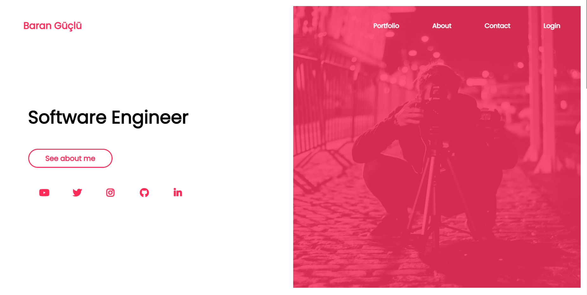
    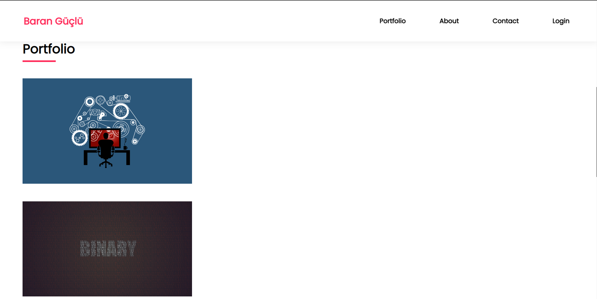
    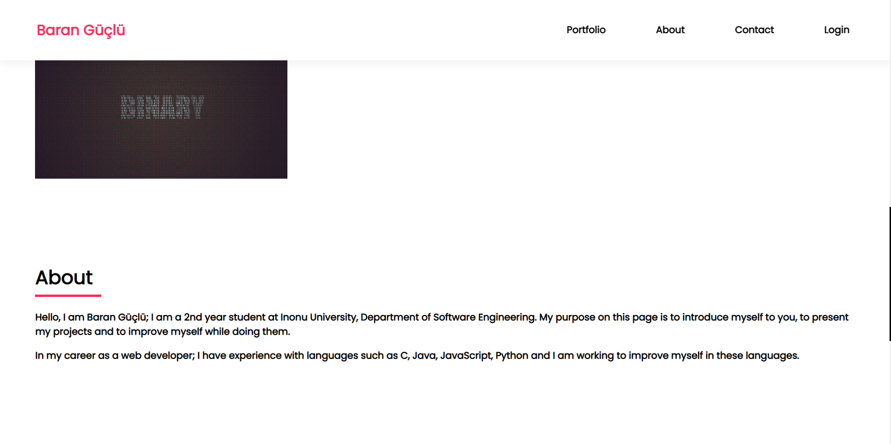
    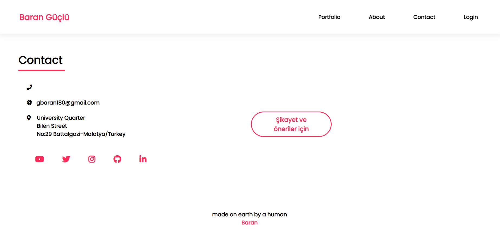
    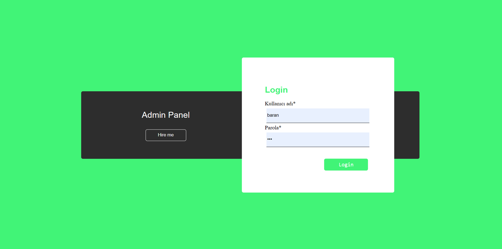
    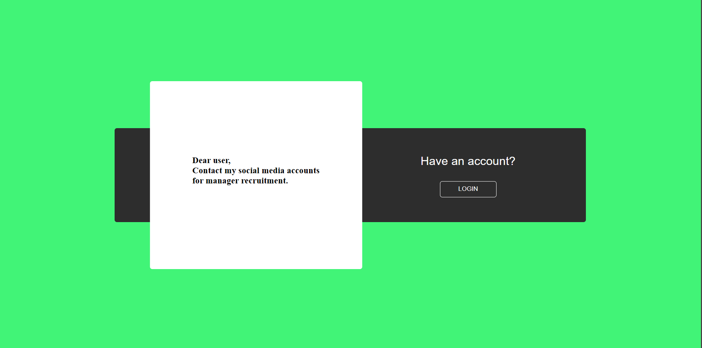
    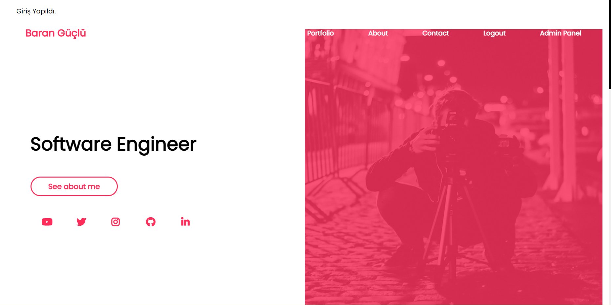
    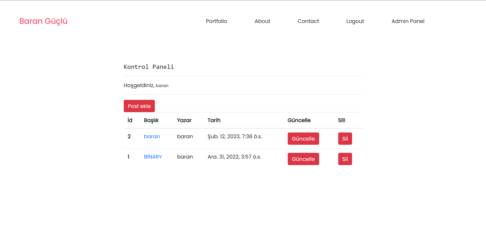
    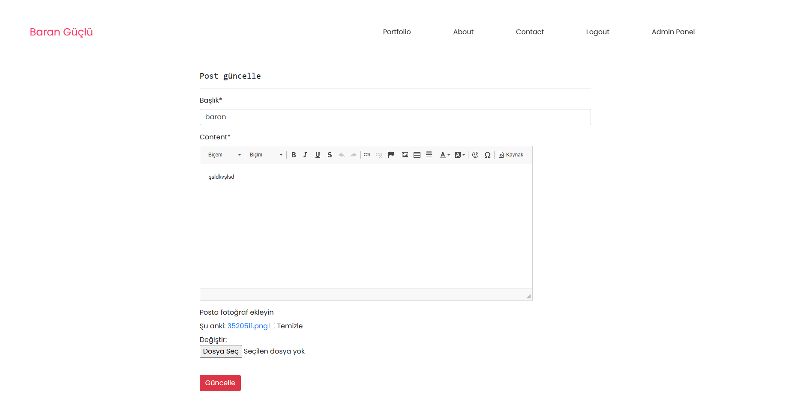
    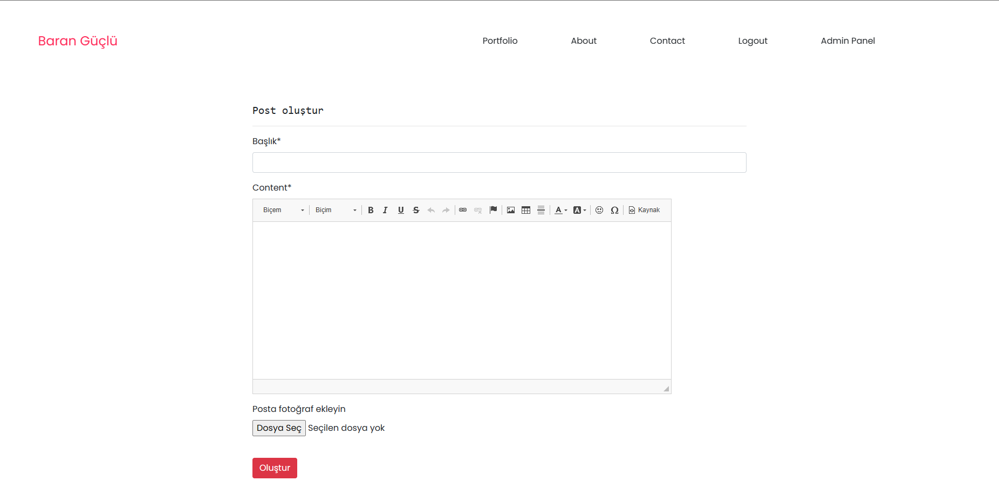
    
    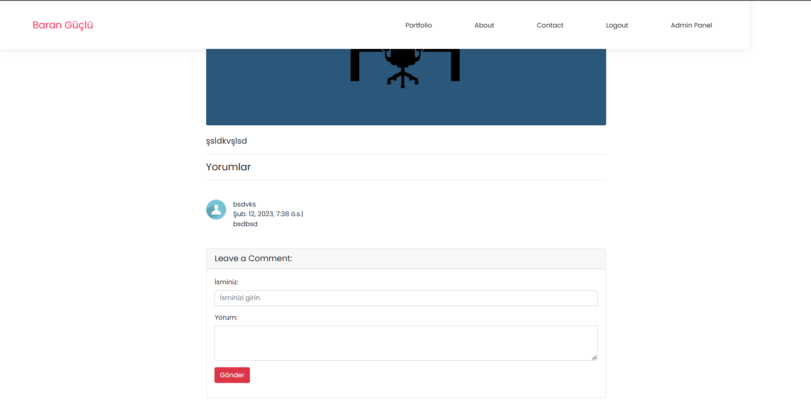
    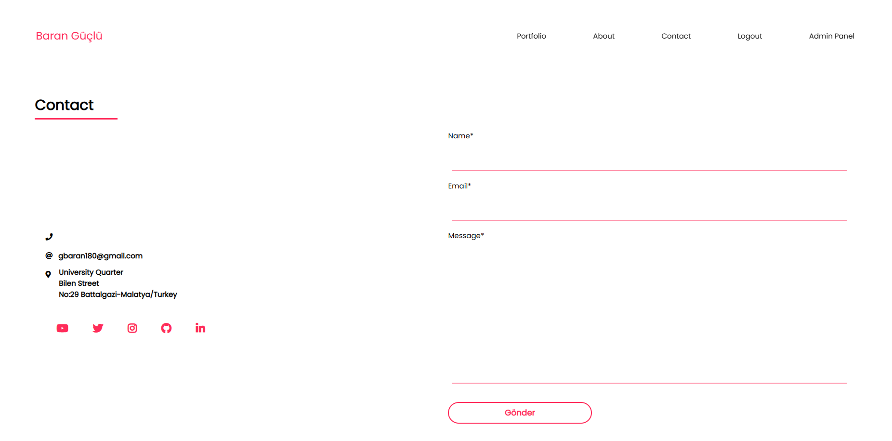
    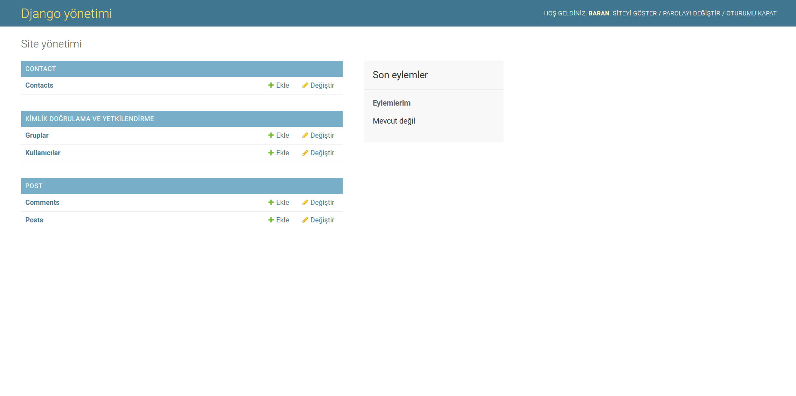
    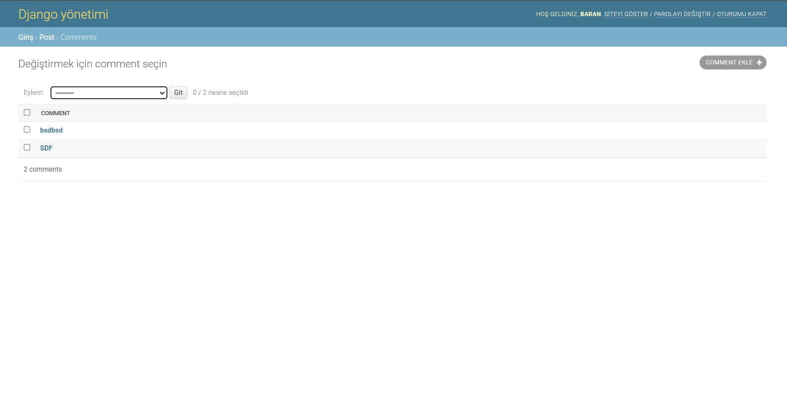
    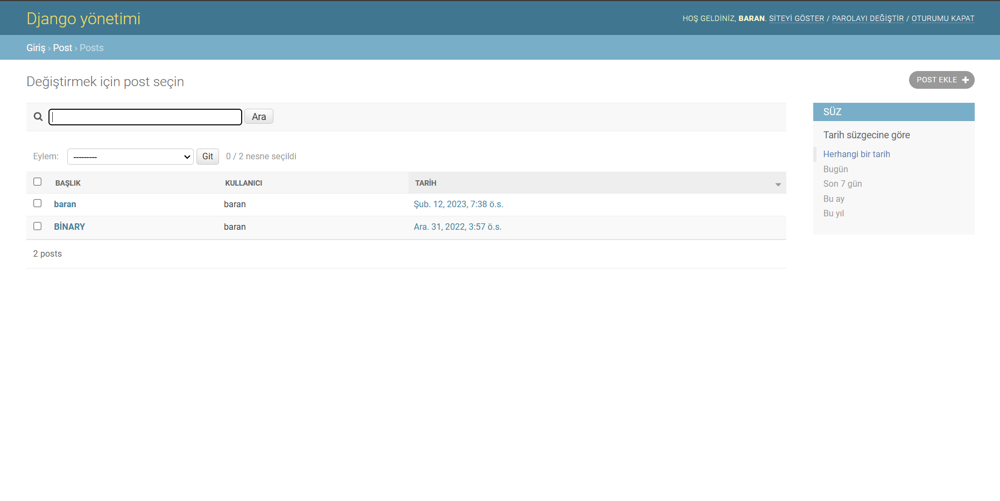
       
    

    <strong>Good luck with your work everyone! If you have any questions,you now know that  you can reach me through my social media accounts on my profile. See you later!</strong>
      
    
    

    
